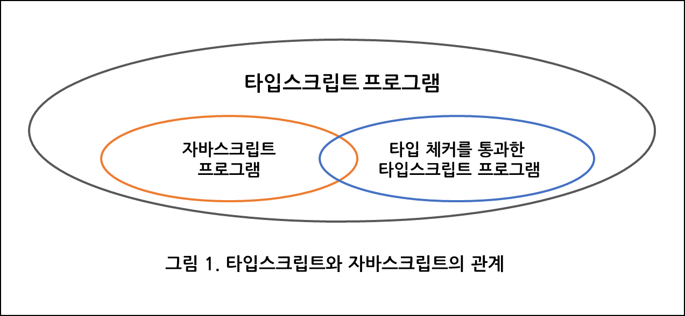

## 1. 타입스크립트 알아보기

### ✅ 공부한 내용 정리

## 아이템 1 타입스크립트와 자바스크립트의 관계 이해하기



#### `타입스크립트는 자바스크립트의 상위 집합`이다. 를 알아본다.

#### 타입스크립트는 최종적으로 자바스크립트로 변환 된다.

#### 1. 모든 자바스크립트는 타입스크립트지만, 모든 타입스크립트가 자바스크립트는 아니다

```ts
// 자바스크립트 오류 O, 타입스크립트 오류 발생 X
function greet(who: string) {
  console.log('Hello', who);
}
```

#### 2. 모든 자바스크립트는 타입스크립트지만, 일부 자바스크립트(타입스크립트)만이 타입 체크를 통과한다.

```ts
// 1. 자바스크립트 오류 X , 타입스크립트 오류 X(타입 체크 통과)
const x = 2 + '3'; // string 타입
const y = '3' + 2; // string 타입
// 두 줄 모두 문자열이 "23"이 되는 자바스크립트 런타임 동작으로 모델링 됨
```

```ts
// 2. 자바스크립트 오류 X, 타입스크립트 오류 O(타입 체크 미통과)
const a = null + 7; // js -> a 값이 7, ts -> 오류(+ 연산자를 ~ 형식에 적용할 수 없습니다.)
const b = [] + 12; // js -> b 값이 12, ts -> 오류(+ 연산자를 ~ 형식에 적용할 수 없습니다.)
alert('Hello', 'ts'); // js -> 'Hello' 경고 표시, ts -> 오류(0~1개의 인수가 필요한데 2개를 가져왔습니다.)
```

```ts
// 3. 자바스크립트 오류 O, 타입스크립트 오류 O(타입 체크 미통과)
const names = ['lee', 'kim'];
console.log(names[2].toUpperCase()); // TypeError 발생 -> 런타임 오류 발생
```

💡 **컴파일타임과 런타임과 에러**

1. 컴파일타임 - 개발자가 작성한 소스코드를 컴파일하여 기계어로 변환하는 과정<br>
   컴파일타임 에러 - syntax error(문법적 오류), 파일참조 오류, 타입체크 오류...<br>
   -> 컴파일러는 컴파일 타임 에러를 발생시키고 일반적으로 문제를 일으킨 소스코드 라인을 지시해줌

2. 런타임 - 컴파일을 마친 프로그램이 사용자에 의해 실행되어 동작되어지는 때<br>
   런타임 에러 - 0나누기 오류, null참조 오류, 메모리 부족 오류<br>
   -> 프로그램이 실행중에 발생하는 형태의 오류로 사용자가 맞닥뜨릴 수 있으므로 조심해야 함

- 컴파일은 타입체크와 독립적으로 동작하기 때문에 타입오류가 있는 코드도 컴파일이 가능하다.
- 컴파일은 코드가 생성될때만 할 수 있는 말이고, 코드에 오류가 있다면 타입체크에 문제가 있다고 한다.
- 런타임에는 타입체크가 불가능하다.

🎯 **요약**

> 1.  타입스크립트는 자바스크립트의 상위집합이다. <br>
>     모든 자바스크립트 프로그램은 이미 타입스크립트 프로그램이다. <br>
>     타입스크립트에는 별도의 문법이 존재하기 때문에, 그 반대는 성립하지 않는다.

> 2.  자바스크립트는 런타임에서 타입을 알게되고,<br>
>     타입스크립트 타입 시스템은 자바스크립트 런타임 동작을 모델링 한다.<br><br>
>     따라서 런타임으로 가기전에 타입검사를 함으로 런타임에 발생할 수 있는 오류를 먼저 잡아낼 수 있어 개발자에게 빠르게 알려줄 수 있다.<br><br>
>     다만, 모든 오류를 찾을 순 없다.<br>
>     (타입 체커를 통과하면서도 런타임 오류를 발생시킬 수 있음)

## 아이템 2 타입스크립트 설정 이해하기

타입스크립트의 설정은
어디서 소스파일을 찾을건지, 어떤 종류의 출력을 생성할지를 제어, 언어 자체의 핵심요소를 제어 등등

또한 ts설정은 커맨드 라인보다는 tsconfig.json을 사용한다.

#### 1. 설정 파일 생성

```
tsc --init
```

#### 2. 핵심 설정

> 1.  `noImplicitAny` - 변수들이 미리 정의된 타입을 가져야 하는지 여부를 제어
> 2.  `strictNullChecks` - null과 undefined가 모든 타입에서 허용되는지 확인하는 설정

```ts
{
  "compilerOptions": {
    "noImplicitAny": true,
    "strictNullChecks": true,
  }
}
```

#### 3. 타입스크립트에서 엄격한 체크를 하고 싶다면, `strict`설정을 고려한다.

#### 4. [추가 설정](https://geonlee.tistory.com/214) / [박영웅님 세션 설정](https://curse-battery-d1c.notion.site/KDT4-TS-2d6706247b014cf3bb2bd34e73fd9ef0)

## 아이템 3 코드 생성과 타입이 관계없음을 이해하기

#### 1. 타입스크립트 컴파일러의 두가지 독립적 역할

> 1.  최신 ts/js를 브라우저에서 동작할 수 있도록 구버전의 js로 트랜스파일(번역+컴파일)함
> 2.  코드의 타입 오류를 체크

#### 2. 타입 오류가 있는 코드도 코드 생성(컴파일)은 가능하다.

```ts
let x = 'hello';
x = 1234;
// tsc test.ts
// text.ts:2:1 - error TS2322: '1234'형식은 'string' 형식에 할당할 수 없습니다.
```

#### 3. 런타임에는 타입 체크가 불가능하다.

```ts
// instanceof 체크는 런타임에 일어나지만,
// Rectangle은 타입이기 때문에 런타임 시점에 아무런 역할을 못함
interface Square {
  width: number;
}
interface Rectangle extends Square {
  height: number;
}
type Shape = Square | Rectangle;
function calculateArea(shape: Shape) {
  if (shape instanceof Rectangle) {
    // 오류: 'Rectangle'은 형식만 참조하지만, 여기서는 값으로 사용되고 있습니다.
    return shape.width * shape.height; // 오류: 'Shape' 형식에 'height' 속성이 없습니다.
  } else {
    return shape.width * shape.width;
  }
}
```

#### 해결법 -> 태그된 유니온과 속성 체크 방법 or 클래스 같이 ts 타입과 런타임 값, 둘다 제공\

❓ **태그된 유니온 (Tagged Union) 이란?**<br>

상황에 따라 인터페이스를 분리한 후 해당 인터페이스들을 type을 이용하여 유니온으로 사용한 것<br>
태그는 type에 주어진 개별 속성이며 런타임 시 타입의 범위를 줄일 수 있도록 도와준다.<br>
태그된 유니온은 런타임 타입 체커와 잘 맞기 때문에 필요 시 사용하자

```ts
interface Square {
  kind: 'square';
  width: number;
}

interface Rectangle {
  kind: 'rectangle';
  height: number;
  width: number;
}

type Shape = Square | Rectangle; // 태그된 유니온

function calculateArea(shape: Shape) {
  if (shape.kind === 'rectangle') {
    shape; // 타입이 Rectangle
    return shape.width * shape.height;
  } else {
    shape; // 타입이 Square
    return shape.width * shape.width;
  }
}
```

```ts
// 2. 타입을 클래스로 만들기
class Square {
  constructor(public width: number) {}
}

class Rectangle extends Square {
  constructor(public width: number, public height: number) {
    super(width);
  }
}

type Shape = Square | Rectangle;

function calculateArea(shape: Shape) {
  if (shape instanceof Rectangle) {
    shape; // 타입이 Rectangle
    return shape.width * shape.height;
  } else {
    shape; // 타입이 Square
    return shape.width * shape.width; // 통과
  }
}
```

#### 4. 타입 연산은 런타임에 영향을 주지 않는다.

`string 또는 number 타입인 값을 항상 number로 정제하는 경우`

1. 타입 체커 통과하지만 잘못된 방법

```ts
function asNumber(val: number | string): number {
  return val as number;
}
```

```js
// 변환된 js 파일
function asNumber(val) {
  return val;
}
```

2. 올바른 방법

```ts
function asNumber(val: number | string): number {
  return typeof val === 'string' ? Number(val) : val;
}
```

#### 5. 런타임 타입은 선언된 타입과 다를 수 있다.

```ts
// 여기서의 : boolean은 타입 선언문으로 타입 스크립트의 구문이기에 런타임시 제거되기 때문에,
//자바스크립트였다면 setLightSwitch('on') 으로 호출 할 수도 있었을 것입니다.
function setLightSwitch(value: boolean) {
  switch (value) {
    case true:
      turnLightOn();
      break;
    case false:
      turnLightOff();
      break;
    default:
      console.log(`I'm afraid I can't do that.`);
  }
}

// 순수 타입스크립트에서도 네트워크 호출로 값을 받아온 경우, 타입이 달라질 수도 있다.
interface LightApiResponse {
  lightSwitchValue: boolean;
}

async function setLight() {
  const response = await fetch('/light');
  const result: LightApiResponse = await response.json();
  setLightSwitch(result.lightSwitchValue);
  // API를 잘못 파악했거나 배포 후에 API가 변경됬을 때,
  // LightApiResponse가 문자열로 바뀌게 되는 경우가 있을 수 있다.
  // 그렇기 때문에 선언된 타입이 언제든지 달라질 수 있다는 것을 명심해야 한다.
}
```

#### 6. 타입스크립트 타입으로는 함수를 오버로드할 수 없다.

💡 **오버로드 VS 오버로딩**

1. 오버로드(Overload)는 하나의 함수에 대해 다양한 시그니처(매개변수와 반환 타입)를 정의하는 것을 의미한다.

```ts
function add(a: number, b: number): number;
function add(a: string, b: string): string;
function add(a: any, b: any): any {
  return a + b;
}
console.log(add(2, 3)); // 출력: 5 (숫자형 오버로드 호출)
console.log(add('Hello, ', 'TypeScript!'));
// 출력: Hello, TypeScript! (문자열 오버로드 호출)
```

2. 오버로딩(Overloading)은 객체 지향 프로그래밍에서 사용되는 개념으로, 하나의 클래스 내에서 동일한 이름을 가진 메서드를 여러 개 정의하는 것을 의미한다. <br>이 때, 메서드의 매개변수의 개수나 타입이 다르거나, 메서드의 이름이 같은데 매개변수의 형식이 다르다면 오버로딩이라고 한다.

```ts
class Calculator {
  add(a: number, b: number): number {
    return a + b;
  }

  add(a: string, b: string): string {
    return a + b;
  }
}
const calculator = new Calculator();
console.log(calculator.add(2, 3)); // 출력: 5 (숫자형 오버로딩 호출)
console.log(calculator.add('Hello, ', 'TypeScript!'));
// 출력: Hello, TypeScript! (문자열 오버로딩 호출)
```

```ts
function add(a: number, b: number) {
  return a + b;
}
// ~~ 중복된 함수 구현입니다.

function add(a: string, b: string) {
  return a + b;
}
// ~~ 중복된 함수 구현입니다.
```

하나의 함수에 대해 여러 개의 선언문을 작성할 수 있지만, 구현체는 오직 하나여야 한다.

```ts
function add(a: number, b: number): number;
function add(a: string, b: string): string;
function add(a, b) {
  return a + b;
}
const three = add(1, 2); // 타입 number
const twelve = add('1', '2'); // 타입 string
```

#### 7. 타입스크립트 타입은 런타임 성능에 영향을 주지 않는다.

🎯 **요약**

> 1.  코드 생성은 타입시스템과 무관하다. <br>
>     타입스크립트 타입은 런타임 동작이나 성능에 영향을 주지 않는다. <br>

> 2.  타입 오류가 존재하더라도 코드 생성(컴파일)은 가능하다.

> 3. 타입스크립트 타입은 런타임에 사용할 수 없다.
>    런타임에 타입을 지정하려면, 타입 정보 유지를 위한 별도의 방법이 필요하다. (태그된 유니온과 속성 체크 방법 또는 클래스)

## 아이템 4 구조적 타이핑에 익숙해지기

#### 1. 자바스크립트는 덕 타이핑 기반이다.<br>

#### 타입스크립트가 이를 모델링하기 위해 구조적 타이핑을 사용함을 이해해야 한다.

💡 **덕 타이핑 VS 구조적 타이핑**

#### 덕 타이핑 - 객체의 타입이나 클래스가 중요한 것이 아니라, 객체가 어떤 메서드나 속성을 지니고 있는지에 따라 타입이 결정된다는 개념입니다. <br>

#### 구조적 타이핑 - 객체들이 같은 구조를 가지면 같은 타입으로 간주되는 것을 의미합니다.

> 1.  덕 타이핑은 런타임에 타입을 체크한다. (혹은 안할수도 있음)
> 2.  구조적 타이핑은 타입 시스템 기반에서 컴파일 타임(혹은 타입체커)에서 타입을 체크한다.
> 3.  즉, 둘 다 객체의 변수, 메소드 같은 필드를 기반으로 타입을 체크(혹은 안할수도)하지만 덕 타이핑은 동적 타이핑에서, 구조적 타이핑은 정적 타이핑에서 쓰인다.
> 4.  덕 타이핑은 다형성 관점에서 주목해야하고, 구조적 타이핑은 타입 체킹 관점이다.

```ts
// NamedVector의 구조가 Vector2D와 호환되기 때문에 calculateLength 호출 가능
// -> 구조적 타이핑
function calculateLength(v: Vector2D) {
  return Math.sqrt(v * x + v * x + v * y + v * y);
}
interface NamedVector {
  name: string;
  x: number;
  y: number;
}
const v: NamedVector = { x: 3, y: 4, name: 'vector' };
calculatedLength(v); // 5
```

#### 어떤 인터페이스에 할당 가능한 값이라면, 타입 선언에 명시적으로 나열된 속성들을 가지고 있다.<br>

#### 타입은 '봉인'되어 있지 않고, 열려 있다.<br>

```ts
interface Vector3D {
  x: number;
  y: number;
  z: number;
}
function calculateLengthL1(v: Vector3D) {
  let length = 0;
  for (const axis of Object.keys(v)) {
    const coord = v[axis]; // 오류 발생
    // 'string'은 'Vector3D'의 인덱스로 사용할 수 없기에 엘리먼트는 암시적으로 'any' 타입
    length += Math.abs(coord);
  }
  return length;
}
// v는 어떤 속성이든 가질 수 있어서 v[axis]가 number라고 확정 할 수 없다.
```

#### 2. 클래스도 구조적 타이핑 규칙을 따른다.<br>

#### 클래스의 인스턴스가 예상과 다를 수 있다.

```ts
class C{
  foo: string;
  constructor(foo: string){
    this.foo = foo;
  }
}
const c: new C('instance of C');
const d: C = { foo: 'object literal'}; // 통과
// 구조적으로는 필요한 속성과 생성자가 존재하기 때문에 문제가 없다.
```

#### 3. 구조적 타이핑을 사용하면 유닛 테스팅을 손쉽게 할 수 있다.

```ts
test('getAuthors', () => {
  const authors = getAuthors({
    runQuery(sql: string) {
      return [
        ['Toni', 'Morrison'],
        ['Maya', 'Angelou'],
      ];
    },
  });
});
expect(authors).toEqual([
  { first: 'Toni', last: 'Morrison' },
  { first: 'Maya', last: 'Angelou' },
]);
```

🎯 **요약**

> 1.  자바스크립트가 덕 타이핑 기반이고 타입스크립트가 이를 모델링하기 위해 구조적 타이핑을 사용함을 이해해야 한다.<br>
>     어떤 인터페이스에 할당 가능한 값이라면 타입 선언에 명시적으로 나열된 속성들을 가지고 있다.<br>
>     타입은 '봉인'되어 있지 않고, '열려'있다.

> 2. 클래스 역시 구조적 타이핑 규칙을 따른다. <br>
>    클래스의 인스턴스가 예상과 다를 수 있다.

> 3. 구조적 타이핑을 사용하면 유닛 테스닝을 손쉽게 할 수 있다.<br>

## 아이템 5 any 타입 지양하기

any 타입을 지양해야되는 6가지 이유

#### 1. any는 타입 안전성이 없다.

```ts
let age: number;
age = '12'; // '"12"' 형식은 'number' 형식에 할당 할 수 없습니다.
age = '12' as any; // 통과
age += 1; // 런타임에 정상, age는 "121"
```

#### 2. any는 함수 시그니처를 무시한다.

❓ **함수 시그니처란 ?**<br>
함수의 매개변수와 반환값의 타입을 정의하는 방법입니다.

```ts
// birthDate 매개변수는 string이 아닌 Date 타입 이어야 함
function calculateAge(birthDate: Date): number {
  //...
}
let birthDate: any = '1999-08-25'; // any 사용으로 인해 calculateAge 시그니처 무시
calculateAge(birthDate); // 통과
```

#### 3. any는 언어 서비스가 적용되지 않는다.

자동완성 기능과 적절한 도움말(이름 변경 기능 등)을 제공 받지 못한다.

#### 4. any는 코드 리팩토링 때 버그를 감춘다.

1. 어떤 아이템을 선택할 수 있는 웹 애플리케이션을 만든다고 가정<br>
2. 애플리케이션에는 `onSelectItem` 콜백이 있는 컴포넌트가 존재<br>
3. 선택하려는 아이템의 타입이 무엇인지 모르니 `any`를 써보자<br>
4. `onSelectItem에` `id`만 필요하니까 `ComponentProps`의 시그니처를 수정<br>
5. `id`를 전달받으면, 타입 체커를 통과함에도 불구하고 런타임에는 오류가 발생

```ts
// 수정 전
interface ComponentProps {
  onSelectItem: (item: any) => void;
}

// 수정 후
interface ComponentProps {
  onSelectItem: (item: number) => void;
}

// 유지
function renderSelector(props: ComponentProps) {
  //...
}

let selectedId: number = 0;

function handleSelectItem(item: any) {
  selectedId = item.id;
}

renderSelector({ onSelectItem: handleSelectItem });
```

#### 5. any는 타입 설계를 감춘다.

타입 설계는 정확하고 명료한 코드 작성을 위해 필수이다.<br>
또한 동료들과의 원활한 협업을 위해 필수이다.

#### 6. any는 타입시스템의 신뢰도를 떨어뜨린다.

any 타입을 쓰지 않으면, 런타임에 발견된 오류를 미리 잡아 신뢰도를 높일 수 있다.<br>

어쩔 수 없이 any를 사용해야 하는 상황에서,<br>
any의 단점을 보완하는 방법에 대해서 5장에서 배우자

🎯 **요약**

> 1. any 타입을 사용하면 타입 체커와 타입스크립트 언어 서비스를 무력화시킨다.<br> any 타입은 진짜 문제점을 감추며, 개발 경험을 나쁘게 하고, 타입 시스템의 신뢰도를 떨어뜨린다. <br>

### ✅ 질문

1. TypeScript와 JavaScript의 관계를 설명해주세요.
2. TypeScript의 any 타입은 왜 지양해야 하는가요?
3. 구조적 타이핑에 대해 설명해주세요.

### ✅ 답

1. TypeScript는 JavaScript의 상위 집합으로, 정적 타입 시스템을 갖추고 있어 코드의 안정성과 가독성을 높이며, 강력한 도구 지원으로 개발 생산성을 향상시킵니다. 자바스크립트 코드를 TypeScript로 쉽게 변환할 수 있고, 자바스크립트 생태계와 호환됩니다.
2. any 타입은 타입 안전성이 없어서 타입 체크를 우회할 수 있고, 함수 시그니처를 무시하며, 언어 서비스를 제공받지 못합니다. 또한 코드 리팩토링 때 버그를 감출 수 있으며, 타입 설계를 감추고, 타입 시스템의 신뢰도를 떨어뜨립니다.
3. 구조적 타이핑은 TypeScript에서 객체의 변수, 메서드 같은 필드를 기반으로 타입을 체크하는 것을 의미합니다.

### ✅ 느낀점

아이템 5의 4번이 잘 안와닿는다.<br>
모델링이 뭘까..?<br>
1장이라 금방 끝날 줄 알았는데, 엄청 오래걸렸다.<br>
정리를 어느정도 해야할지..감이 안잡힌다.
피드백 환영입니다!

### ✅ 참고자료

이펙티브 타입스크립트<br>
아이템 1 & 3 [컴파일 타임과 런타임과 에러](https://im-designloper.tistory.com/118) / [컴파일 타임과 런타임](https://yeko90.tistory.com/entry/compile-time%EC%BB%B4%ED%8C%8C%EC%9D%BC-%ED%83%80%EC%9E%84-vs-runtime%EB%9F%B0%ED%83%80%EC%9E%84-%EC%B0%A8%EC%9D%B4)<br>
아이템 2 [추가 tsconfig.json 설정](https://geonlee.tistory.com/214)<br>
아이템 2 [추가 tsconfig.json 박영웅님](https://curse-battery-d1c.notion.site/KDT4-TS-2d6706247b014cf3bb2bd34e73fd9ef0)<br>
아이템 3 [태그된 유니온](https://velog.io/@ysong0504/Effective-Typescript-%EC%95%84%EC%9D%B4%ED%85%9C-32-%EC%9C%A0%EB%8B%88%EC%98%A8%EC%9D%98-%EC%9D%B8%ED%84%B0%ED%8E%98%EC%9D%B4%EC%8A%A4%EB%B3%B4%EB%8B%A8-%EC%9D%B8%ED%84%B0%ED%8E%98%EC%9D%B4%EC%8A%A4%EC%9D%98-%EC%9C%A0%EB%8B%88%EC%98%A8%EC%9D%84-%EC%82%AC%EC%9A%A9%ED%95%98%EA%B8%B0)<br>
아이템 4 [덕타이핑 vs 구조적 타이핑](https://vallista.kr/%EB%8D%95-%ED%83%80%EC%9D%B4%ED%95%91%EA%B3%BC-%EA%B5%AC%EC%A1%B0%EC%A0%81-%ED%83%80%EC%9D%B4%ED%95%91/)<br>
